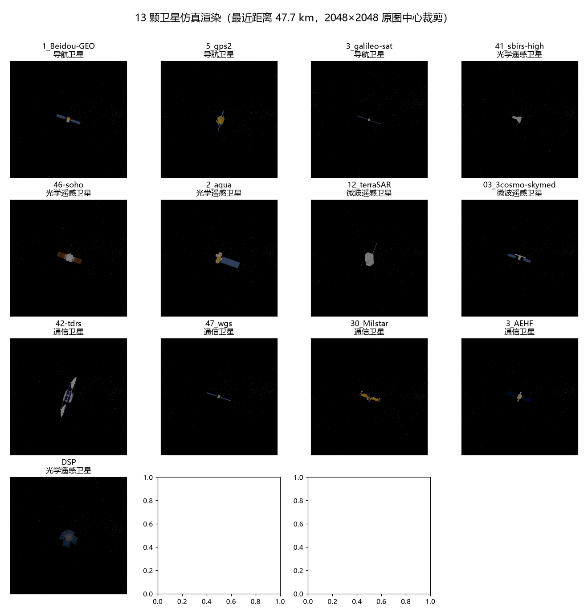
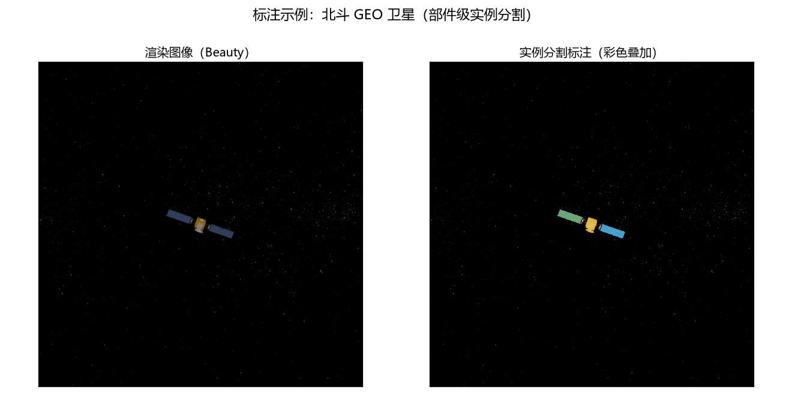

# 卫星交会成像仿真系统与数据集建设汇报

> 2026-08

---

## 一、项目概述

本项目构建了一套**空间交会工况卫星成像仿真系统**，以观察卫星第一视角对目标卫星进行连续成像仿真，生成带像素级标注的高质量仿真图像数据集，为空间目标**检测、实例分割和位姿估计**算法的训练与验证提供数据支撑。

**核心成果一览：**

| 指标 | 数值 |
|------|------|
| 仿真图像总量 | **40,950 张**（2048×2048） |
| 卫星模型 | **13 种真实卫星**（导航/光学遥感/微波遥感/通信四大类） |
| 标注体系 | 5 类部件实例分割 + 整星检测 + 位姿真值 + 成像条件记录 |
| 标注格式 | COCO 检测/分割、YOLO、位姿、实例掩码、影响因素 CSV |
| 轨道数据 | 200 Hz 高精度星历，最近距离 47.7 km |

---

## 二、整体技术方案

### 2.1 系统架构

```
┌───────────────────────────────────────────────────────────┐
│                    第一层：轨道与场景生成                     │
│  STK 11.6（高精度轨道力学） ← MATLAB 控制（COM 接口）        │
│  • 双星交会场景构建、200Hz 瞬时根数 → ECI 星历              │
│  • 太阳位置精确计算（Meeus 天文算法）                        │
└────────────────────────┬──────────────────────────────────┘
                         │ 5 组星历 CSV（观察星/目标星/太阳）
                         ▼
┌───────────────────────────────────────────────────────────┐
│                    第二层：物理渲染                          │
│  Blender Cycles（GPU OptiX 加速，5-10×）                    │
│  • 真实卫星 3D 模型（134 颗模型库，含材质纹理）              │
│  • 星空背景（天球旋转补偿）、地球（8K 蓝纹纹理）             │
│  • 相机：第一视角追踪成像，窄视场 0.08°                      │
└────────────────────────┬──────────────────────────────────┘
                         │ RGB 图像 + 实例分割渲染
                         ▼
┌───────────────────────────────────────────────────────────┐
│                    第三层：标注生成                          │
│  自动生成 5 类标注：                                         │
│  • COCO 检测/分割（含 RLE 编码）  • YOLO 检测框              │
│  • 位姿真值（四元数+相对位置）    • 实例分割掩码             │
│  • 成像条件记录（距离/光照角度/光照强度）                    │
└───────────────────────────────────────────────────────────┘
```

### 2.2 关键技术能力

1. **真实模型渲染**：卫星模型来自公开几何建模库（134 颗真实卫星），通过专用管线转换为可渲染格式，保留部件结构与材质纹理，模型尺寸按真实比例归一化
2. **数据扩增技术**：每帧原始图像自动生成 **15 个变体**——5 种姿态扰动（90° 锥形随机）+ 3 档光照角度（0°/60°/120°）+ 光照强度随机（60–200），标注与图像严格同步
3. **像素级实例标注**：同一卫星区分**本体、太阳翼、相控阵天线、反射面天线、太阳翼支架**五类部件，每类部件独立实例编号
4. **成像条件记录**：每张图像附带距离、光照角度、光照强度等影响因素记录，支持按条件的数据分布分析与分组评测
5. **工程可靠性**：自动断点续传（约 75 小时渲染任务可随时中断恢复）、渲染数据完整性自检

### 2.3 成像工况

| 参数 | 值 |
|------|-----|
| 星历采样率 | 200 Hz（帧间 5 ms） |
| 成像距离范围 | 47.7 – 250 km |
| 分辨率 | 2048×2048，64 采样 |
| 相机视场 | 0.08°（窄视场，远距离目标清晰成像） |
| 图像格式 | 8-bit PNG |

---

## 三、v2.0 数据集建设

### 3.1 数据集版本演进

| 版本 | 模型 | 图像数 | 状态 |
|------|------|--------|------|
| v1.0 | 单个简易模型 | 1,810 | ✅ 已交付 |
| v1.1 | 简易模型 + 扩增 | 15,000 | ✅ 已交付 |
| **v2.0** | **13 种真实卫星模型** | **40,950** | ✅ **已交付** |
| v3.0 | 全部 134 颗卫星 | 40 万+ | 📋 计划中 |

### 3.2 卫星模型选择

从 134 颗卫星模型库中精选 13 颗重点卫星（纹理完备、类别覆盖、构型多样）：

| # | 卫星 | 类别 | 图像数 | 标注部件 |
|---|------|------|--------|----------|
| 1 | NavSat_1_Beidou-GEO | 导航 | 3,150 | 本体/太阳翼/相控阵/反射面/支架 |
| 2 | NavSat_5_gps2 | 导航 | 3,150 | 本体/太阳翼/反射面/支架 |
| 3 | NavSat_3_galileo-sat | 导航 | 3,150 | 本体/太阳翼/支架 |
| 4 | OptSat_41_sbirs-high | 光学遥感 | 3,150 | 本体/太阳翼/支架 |
| 5 | OptSat_46-soho | 光学遥感 | 3,150 | 本体/太阳翼/反射面 |
| 6 | OptSat_2_aqua | 光学遥感 | 3,150 | 本体/太阳翼/支架 |
| 7 | MicSat_12_terraSAR | 微波遥感 | 3,150 | 本体/太阳翼/相控阵 |
| 8 | MicSat_03_3cosmo-skymed | 微波遥感 | 3,150 | 本体/太阳翼/相控阵/反射面 |
| 9 | ComSat_42-tdrs | 通信 | 3,150 | 本体/太阳翼×14/相控阵/反射面×5/支架 |
| 10 | ComSat_47_wgs | 通信 | 3,150 | 本体/太阳翼/反射面×10/支架 |
| 11 | ComSat_30_Milstar | 通信 | 3,150 | 本体/太阳翼×12/反射面×13 |
| 12 | ComSat_3_AEHF | 通信 | 3,150 | 本体/太阳翼/反射面×10/支架 |
| 13 | DSP | 光学遥感 | 3,150 | 5 类部件全套 |



### 3.3 单颗卫星数据构成

| 参数 | 值 |
|------|-----|
| 原始成像帧 | 210 帧 |
| ├ 近距离段（<70 km） | 142 帧（距离连续变化） |
| └ 远距离段（70–250 km） | 68 帧 |
| 每帧扩增 | ×15（5 姿态 × 3 光照角度 × 光照强度随机） |
| **单颗卫星图像** | **210 × 15 = 3,150 张** |
| 数据集总量 | 13 × 3,150 = **40,950 张** |

### 3.4 标注体系

每张图像自动附带以下标注：

| 标注类型 | 内容 | 用途 |
|----------|------|------|
| 实例分割 | 5 类部件逐像素掩码 + COCO 分割（RLE 编码） | 实例分割算法训练 |
| 检测框 | COCO 检测 + YOLO（部件 5 类 + 整星类别） | 目标检测算法训练 |
| 位姿真值 | 目标卫星四元数 + 相对位置（ECI 坐标系） | 位姿估计算法训练 |
| 成像条件 | 距离、光照角度、光照强度（每图一条记录） | 条件分布分析、分组评测 |



### 3.5 数据质量保障

- **标注一致性**：扩增姿态同步写入位姿真值，标注与图像严格一一对应
- **完整性自检**：渲染循环逐帧核对图像与标注文件，中断恢复不丢数据
- **类别覆盖**：13 颗卫星中 5 类部件均有标注样本，整星检测类别 13 个
- **条件多样性**：距离 47.7–250 km 连续覆盖、光照角度 62°–180°、光照强度 3.3× 范围

---

## 四、后续数据集建设计划

### 4.1 v3.0：全模型库数据集（计划）

| 项目 | 方案 |
|------|------|
| 卫星数量 | 全部 **134 颗**（4 大类：导航 7 / 光学遥感 60 / 微波遥感 12 / 通信 55） |
| 单颗图像 | 沿用 v2.0 参数（210 帧 × 15 扩增 = 3,150 张） |
| 数据规模 | 134 × 3,150 ≈ **42 万张**（约 620 GB） |
| 可选减量 | 每颗 50 原始帧 → 约 10 万张 |
| 时间估算 | 单颗约 5 小时，全量约 700 小时（分布式渲染可并行缩短） |
| 前置工作 | 剩余 121 颗模型的部件标注（已有 13 颗的标注经验与工具链） |

### 4.2 能力扩展方向

1. **点目标数据集**：已有解析生成器（高斯 PSF + 星场背景），支撑远距离小目标检测
2. **传感器噪声模型**：分阶段加入，提升仿真数据与真实图像的域相似度
3. **更多工况**：分段 stare 成像方案（T1/T2 分段）已验证，可扩展数据集工况覆盖

---

## 五、总结

- 已建成**完整的卫星交会成像仿真系统**：轨道计算 → 物理渲染 → 自动标注全流程贯通
- v2.0 数据集 **40,950 张**高质量仿真图像已交付，覆盖 13 种真实卫星构型、5 类部件像素级标注、4 类标注格式，可直接支撑检测/分割/位姿估计三类算法训练
- 具备 **134 颗卫星模型库**与成熟工具链，具备快速扩展到 40 万张规模数据集的能力
